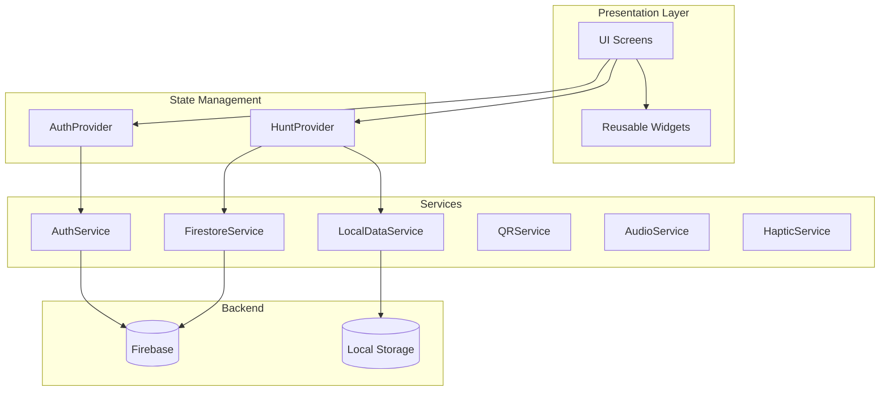
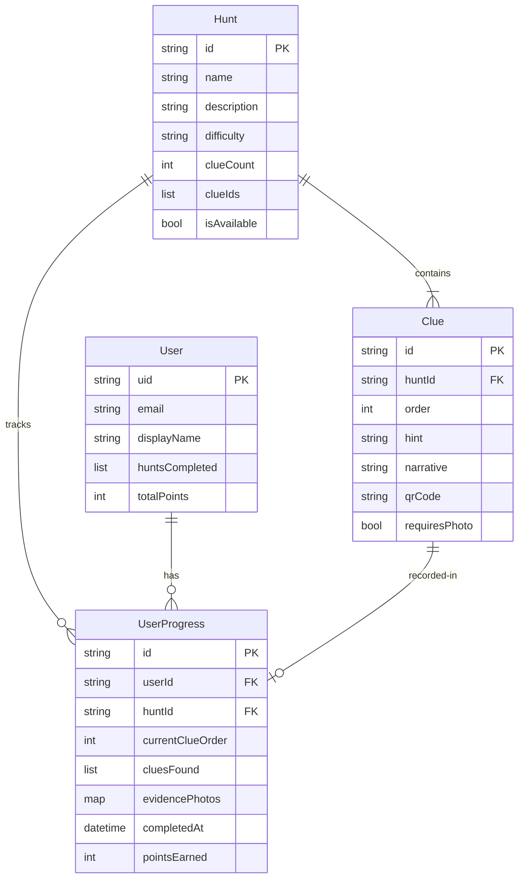
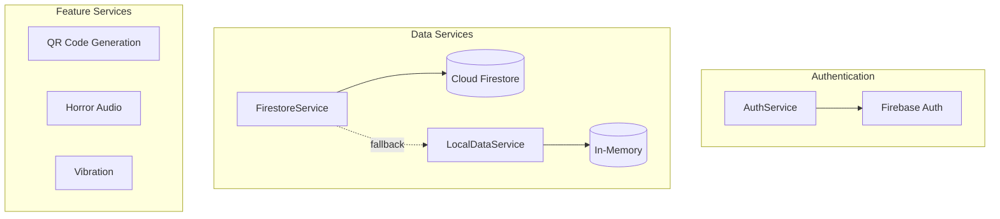
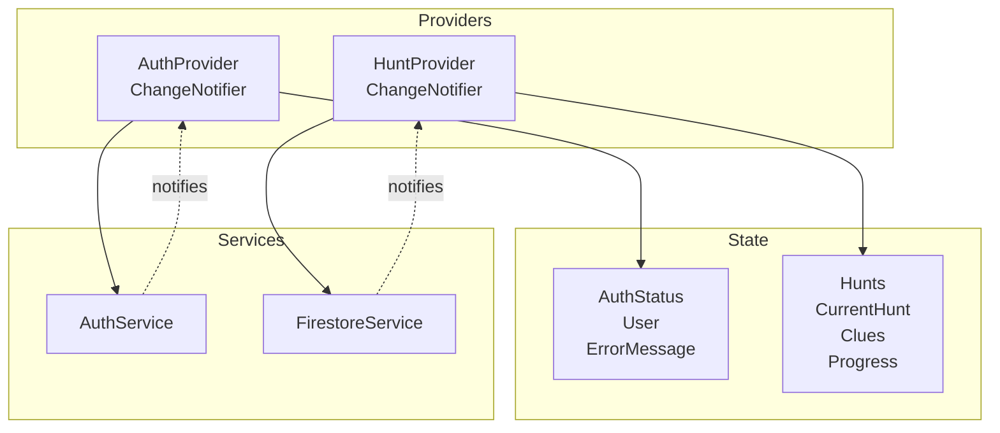
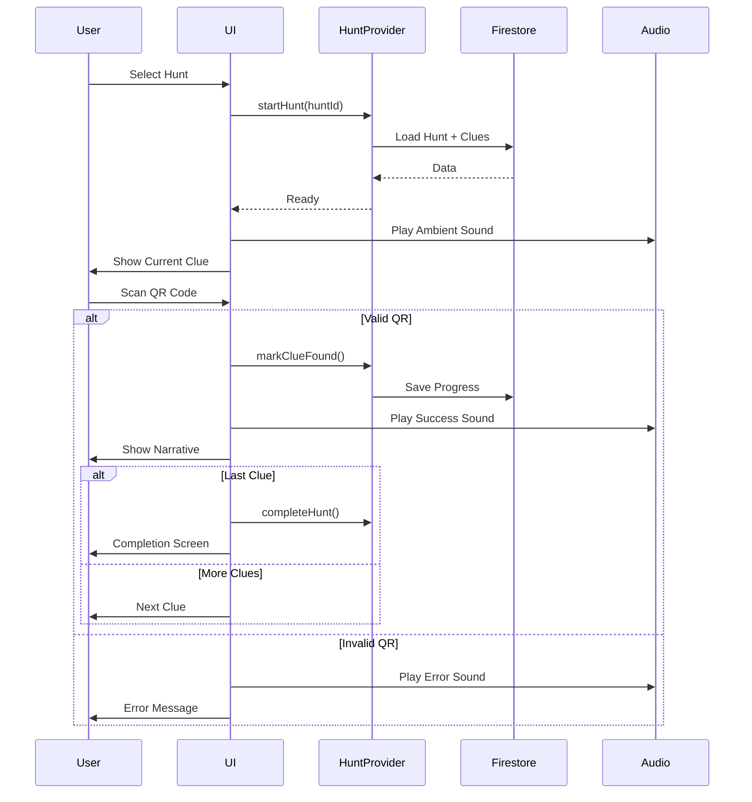
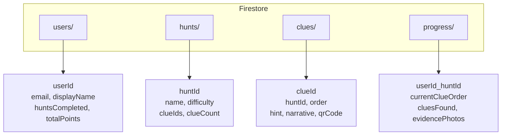
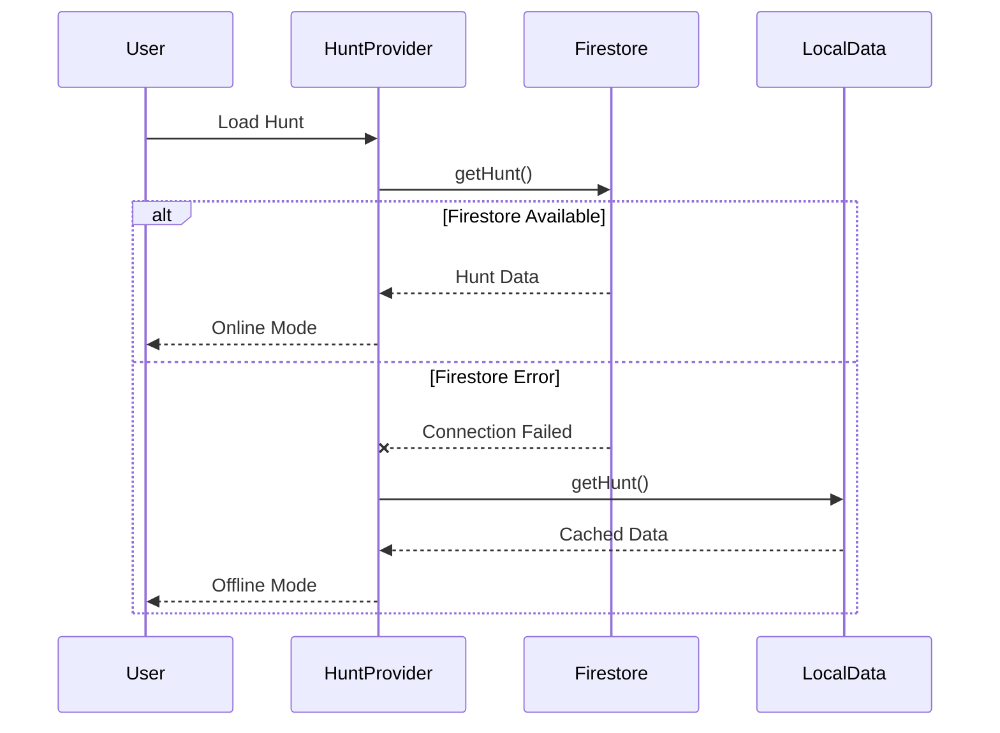

# Unseen - Architecture Documentation

## High-Level Architecture

## Data Model Relationships

## Service Layer Architecture

## State Management

## Navigation Flow

```mermaid
graph TD
    Splash[Splash] --> Auth{Authenticated?}

    Auth -->|No| Login[Login]
    Auth -->|Yes| Home[Home]

    Login --> Register[Register]
    Register --> Home
    Login --> Home

    Home --> HuntSelect[Hunt Select]
    Home --> Profile[Profile]
    Home --> AdminBuilder[Admin Builder]

    HuntSelect --> Hunt[Hunt Screen]
    Hunt --> ClueFound[Clue Found]
    Hunt --> HuntComplete[Hunt Complete]

    ClueFound --> Hunt
    HuntComplete --> Home

    Profile --> Settings[Settings]
    Profile --> PhotoGallery[Photo Gallery]

    style Splash fill:#8B0000
    style Home fill:#4a0e0e
    style Hunt fill:#6b1515
```

## Hunt Gameplay Workflow

## Firebase Collections

## Offline Fallback

---

**Tech Stack:** Flutter 3.x, Firebase (Auth, Firestore, Storage), Provider, GoRouter, mobile_scanner, audioplayers

**Key Patterns:** Provider for state management, Service layer for business logic, Offline-first with local fallback
